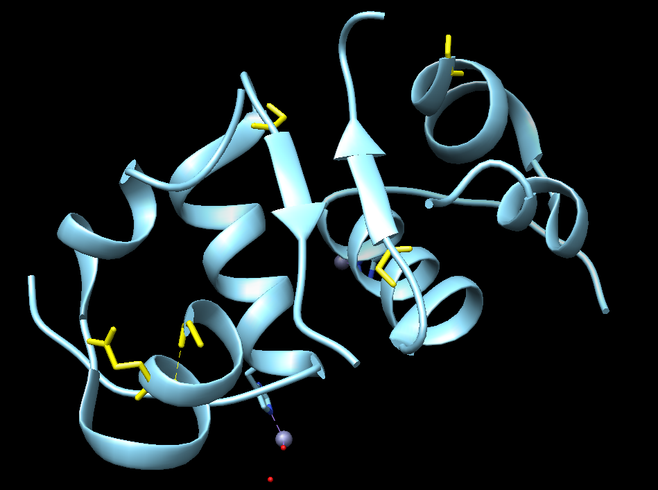

# BS_predictor: Machine Learning-Based Binding Site Prediction for Protein Structures

------------------------------------
**Authors**:
- Denis Expósito Navarro
- Marta Alonso Caubilla
- Yolanda Andrés López

**Version**: 1.1.0 (December 2023)

BS_predictor is a supervised learning method designed to predict binding site residues within a protein structure. Leveraging machine learning techniques, the model analyzes the properties and interactions of residues to make accurate predictions. This Python program is tailored for **UNIX-like** environments.

Pre-requisites
----
The model requires the following packages:

| Package        | Version |
| -------------- | ------- |
| pandas         | >= 2.0   |
| biopython      | >= 1.81  |
| scikit-learn   | >= 1.2.2 |
| numpy          | >= 1.23.4|
| networkx       | >= 3.1   |
| scipy          | >= 1.10.1|

To install these packages, run:

    pip install -r requirements.txt

Additionally, you need to install the DSSP program to access the DSSP database of protein secondary structures. Use the following commands in a UNIX-like environment:

    sudo apt-get install dssp
    sudo ln -s /usr/bin/mkdssp /usr/bin/dssp

Installation
----
To install BS_predictor, navigate to the project folder containing setup.py and run:

    python setup.py install

This installs the program BS_predictor.py, making the command BS_predictor
available in the command line.

To make `BS_predictor` executable from any location in the command line, you can add its directory to your system's PATH.
Add the following line to your shell configuration file (e.g., `~/.bashrc` or `~/.zshrc`):

    export PATH="/path/to/BS_predictor:$PATH"

Replace "/path/to/BS_predictor" with the actual path to the directory containing the BS_predictor.py script.
Then, restart your terminal or run:

    source ~/.bashrc

Usage
-----
Run BS_predictor in the command line using the following syntax:

    BS_predictor -p <input_PDB_file> -o <output_PDB_file_name>

Output
--------------------
The program generates:

- List of residues that belong to the predicted binding site.
- PDB file with information for residues in the predicted binding site to be represented in Chimera or Pymol.

Example
--------------------
For the protein structure 4ins.pdb (blue) the following residues in the predicted binding site (yellow)
are obtained:

- 4ins_A_GLY_1
- 4ins_A_GLN_5
- 4ins_B_GLY_23 
- 4ins_C_GLY_1
- 4ins_D_GLY_23 

